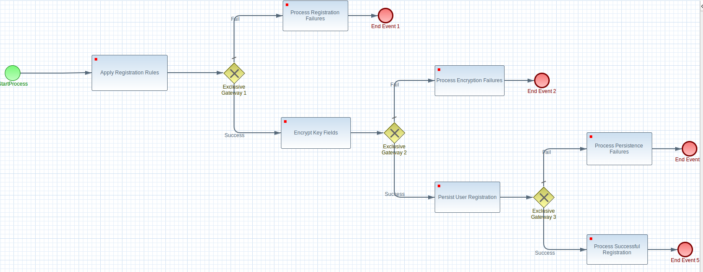

## Mallesh Nagothi - Git Hub Repo
-----
[Visit my Docker Hub](https://hub.docker.com/u/malleshnagothi/ "Mallesh Nagothi Docker Hub Page")
-----

----
<snippet>
  <content><![CDATA[
# ${1:Mallesh Nagothi Git  Hub Repo}
Repor Contains SOA Examples: jBPM [with Custom WorkItem handlers for RESTful Services, dynamically handling Apache-Camel Route, AngularJS with Material Design-Bootstrap,
      Springboot, Wildfly SWARMs, Dockers, Core Java Design Patterns, REST-API with HATEOS

## Installation
TODO: Coming up..........
## Usage
TODO: Write usage instructions [Coming up..........]
## Contributing
1. Fork it!
2. Create your feature branch: `git checkout -b my-new-feature`
3. Commit your changes: `git commit -am 'Add some feature'`
4. Push to the branch: `git push origin my-new-feature`
5. Submit a pull request :D
## History
TODO: Write history
02/27/2017
Initial Delivery of
Cryptography implementation and Javadoc for the same.

What is working, & what is not
CSPRNG is working properly. But generating  Salt from Native library is not working properly on all environment. stay tuned..

<b>02/28/2017</b>
Micro Service added for encrypting given value.

<b>02/28/2017</b>
Added a Restful Service that runs on WildFly swarm
Added a Restful Service that runs on Spring boot
Above both modules dockerized on java:8

<b>03/01/2017</b>
Add a Micro Service for Encrypting a String using CSPRNG Salt.
Added the service in WildFly Swarm
Added the WildFly Swarm to a java Docker image 
visit: https://hub.docker.com/
Search for malleshnagothi to find all of my docker images

What is not working
The service is not flexible (yet) for using multiple alogorithms. But implementation exist, need to expose  more endpoints..coming up

<b>03/02/2017</b>
Add a Micro Service for Encrypting a String using CSPRNG Salt either native calls or with in java libraries.
Added the service in Springboot
Added the Springboot to a java Docker image 
visit: https://hub.docker.com/u/malleshnagothi/
or https://hub.docker.com -->Search for "malleshnagothi" to find all of my docker images

What is not working
The service is not flexible (yet) for using multiple alogorithms. But implementation exist, need to expose  more endpoints..coming up

<b>03/02/2017</b>
Add a Micro Service for saving salt and encrypted password by calling above micro service from docker image
Added the service in Springboot for saving salt and hashed password
Added the Springboot to a java Docker image 
visit: https://hub.docker.com/u/malleshnagothi/
or https://hub.docker.com -->Search for "malleshnagothi" to find all of my docker images

<b>03/05/2017</b>
CSRPNG Micro Service is not changed
Added a  Micro Service with Springboot for JPA persistance 
Implemented Micro Service with HATEOS
CODE STILL NOT CLEAN ENOUGH...coming up....................

<b>03/08/2017</b>
Added new UI project built on plain HTML and Angular JS.
Registration page, calls restful micro service....to register users....

<b>03/10/2017</b>
Time for house cleaning :)
Added Platform-Indep for users who would like to just pull the code, build and run

<b>03/13/2017</b>
Added SPA with AngularJS calling a micro service on springboot --> calling a valudated ssn micros service --> calls a service which loads 
excel rules and applies and returns to service --> if valid snn --> then it calls another micro service sitting on wildfly swarm for validating password business rules
--> if this goes good --> it calls another micros service sitting on wildfly swarm docker for encrypting password with JNI Salt Gen
--> if this goes good another micro service is called for JPA persistence.--> SPA displays message either case..

<b>03/25/2017</b>
Keep pushing code to GIT HUB.. no time to leave comments.. Apologies for  total mess (my Repo], soo clean everyting and will upload documentation for clear understanding of examples..

<b>03/27/2017</b>
Added Enterprise Service Bus capabilities (Apache Camel) runs on Springboot as a RESTful Service

## Credits
TODO: Musthaf [my goto guy for technical discussions.. :) ]
## License
TODO: Nope
]]></content>
  <tabTrigger>readme</tabTrigger>
</snippet>
